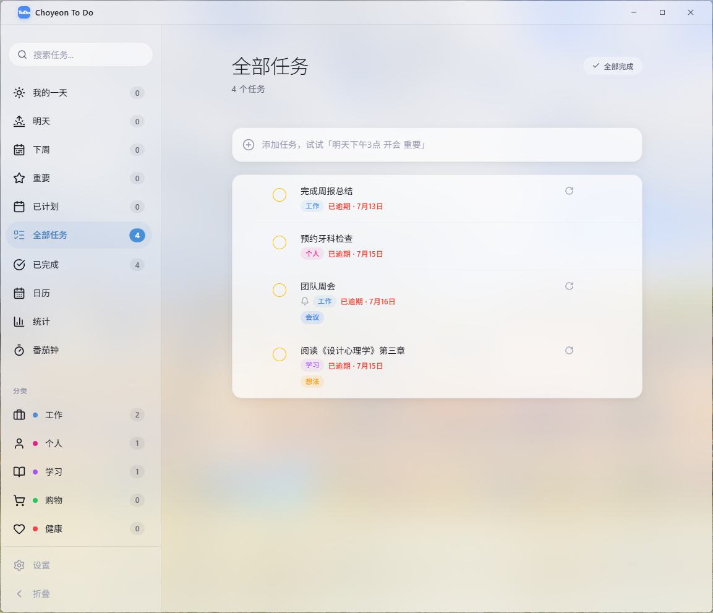
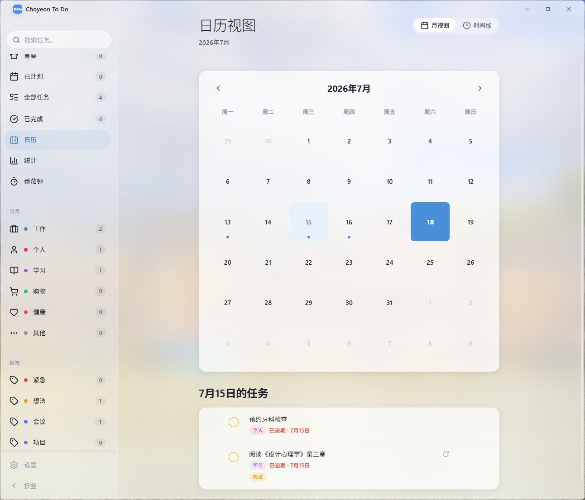
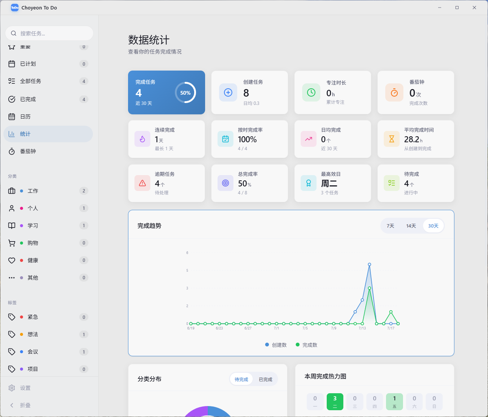
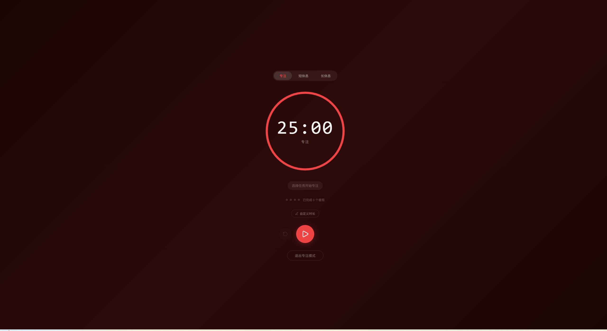

<div align="center">


# Choyeon To Do

**一款现代化的跨平台任务管理应用**

<p align="center">
  <a href="#-功能亮点">功能亮点</a> ·
  <a href="#-下载安装">下载安装</a> ·
  <a href="#-在线体验">在线体验</a> ·
  <a href="#-界面预览">界面预览</a> ·
  <a href="#-使用指南">使用指南</a> ·
  <a href="#-开发指南">开发指南</a>
</p>

[](https://github.com/ChuyuChoyeon/choyeon-todo/releases)
[](#-下载安装)
[](https://chuyuchoyeon.github.io/choyeon-todo/)
[](./LICENSE)

</div>

---

## ✨ 功能亮点

### 🎯 智能任务管理
- **自然语言输入** — 输入「明天下午3点 开会 重要」，自动识别日期、时间、优先级
- **快速添加** — 一行输入，自动提取分类、标签、截止日期
- **批量操作** — 全部完成、批量编辑、撤销删除
- **优先级与分类** — 星标重要任务，自定义彩色分类和标签
- **全局搜索** — 跨所有视图的即时搜索

### 📅 日历与排程
- **月视图** — 整月任务总览，日期点标记任务密度
- **时间线视图** — 24 小时时间轴，精细排程当日任务
- **拖拽调度** — 拖拽任务卡片修改时间
- **智能视图** — 我的一天、明天、下周、已计划、重要、全部

### 🍅 番茄钟
- **三模式计时** — 专注 / 短休息 / 长休息，自动循环
- **自定义时长** — 1~180 分钟自由设定
- **任务绑定** — 将番茄钟绑定到具体任务
- **全屏专注** — 沉浸式全屏专注模式（桌面端独有）
- **番茄计数** — 可视化番茄完成进度

### 📊 数据统计
- **多维统计** — 完成率、连续天数、专注时长、番茄次数、逾期任务
- **趋势可视化** — 创建 vs 完成折线图，7/14/30 天切换
- **分类分布** — 环形饼图，待完成/已完成对比
- **热力图** — 本周完成强度可视化
- **柱状图** — 星期完成分布，发现高效日

### 🎨 设计与体验
- **毛玻璃质感** — 现代半透明 + 模糊效果
- **亮色/暗色主题** — 跟随系统或手动切换
- **流畅动画** — 计数动画、过渡效果、悬停反馈
- **跨平台一致** — Windows / macOS / Web 统一体验
- **多语言支持** — 简体中文 / English / 日本語
- **PWA 离线支持** — Web 端可安装到桌面，离线可用

---

## 🖼 界面预览

| 主界面 | 日历视图 |
| :---: | :---: |
|  |  |
| **数据统计** | **番茄钟** |
|  |  |

---

## 🚀 在线体验

Web 版本可直接在浏览器中体验：

**🌐 https://chuyuchoyeon.github.io/choyeon-todo/**

> Web 版本不包含系统通知、托盘菜单和全局快捷键等 Electron 专属功能。

---

## 💾 下载安装

### 最新版本：v1.0.0

| 平台 | 下载方式 |
|------|----------|
| **Windows** | [安装版 (Setup)](https://github.com/ChuyuChoyeon/choyeon-todo/releases/latest) · [便携版 (Portable)](https://github.com/ChuyuChoyeon/choyeon-todo/releases/latest) |
| **macOS** | [DMG / ZIP](https://github.com/ChuyuChoyeon/choyeon-todo/releases/latest)（支持 Intel / Apple Silicon） |
| **Linux** | [tar.gz](https://github.com/ChuyuChoyeon/choyeon-todo/releases/latest) |

所有版本均在 [Releases 页面](https://github.com/ChuyuChoyeon/choyeon-todo/releases) 提供下载。

### 安装说明

**Windows**
- 安装版：运行 Setup 程序，按照向导完成安装
- 便携版：解压后直接运行 `Choyeon To Do.exe`

**macOS**
- 打开 DMG 文件，将应用拖入 Applications 文件夹
- 首次打开如遇安全提示，请在「系统设置 → 隐私与安全性」中允许打开

---

## 📖 使用指南

### 快速开始

1. **添加任务** — 在顶部输入框中输入任务内容，按回车添加
2. **智能识别** — 输入时自动识别日期、时间、优先级和分类
   - 示例：`明天下午3点 开会 #工作 重要`
3. **管理任务** — 点击复选框标记完成，点击任务内容编辑详情
4. **切换视图** — 使用左侧边栏在不同视图间切换

### 键盘快捷键

| 快捷键 | 功能 |
|--------|------|
| `Ctrl/Cmd + N` | 新建任务 |
| `Ctrl/Cmd + F` | 搜索任务 |
| `Ctrl/Cmd + ,` | 打开设置 |
| `Esc` | 关闭弹窗 / 取消编辑 |

> 更多快捷键请在应用设置中查看。

---

## 🔧 开发指南

### 环境要求

- Node.js >= 18
- npm >= 9

### 快速开始

```bash
# 克隆仓库
git clone https://github.com/ChuyuChoyeon/choyeon-todo.git
cd choyeon-todo

# 安装依赖
npm install

# 开发模式 (Web)
npm run dev

# 开发模式 (Electron 桌面端)
npm run electron:dev
```

### 构建

```bash
# 构建 Web 版本
npm run build

# 构建 Windows 版本（Windows 上运行）
npm run electron:build:win

# 构建 macOS 版本（需在 macOS 上运行）
npm run electron:build:mac

# 构建 Linux 版本
npm run electron:build:linux
```

构建产物位于 `app-build/` 目录。

### 测试

```bash
# 运行单元测试
npm run test:run

# 测试覆盖率
npm run test:coverage
```

### 技术栈

| 层级 | 技术 |
|------|------|
| 桌面框架 | Electron 43 |
| 前端框架 | Vue 3.5 + Vite 8 |
| 状态管理 | Pinia 3 |
| 路由 | Vue Router 4 |
| 测试 | Vitest 4 |
| 打包 | electron-builder 26 |
| 图标 | Lucide Icons |
| PWA | vite-plugin-pwa |
| 国际化 | vue-i18n |

---

## 📝 更新日志

### v1.0.0 — 2026-07-18

首次正式发布。

**核心功能**
- 智能任务管理（自然语言解析）
- 日历视图（月视图 + 时间线）
- 番茄钟（三模式 + 全屏专注）
- 数据统计（折线图、饼图、热力图、柱状图）
- 系统通知与任务提醒
- 亮色/暗色主题切换
- PWA 离线支持
- 多语言（简体中文 / English / 日本語）

**安全**
- IPC 发送方校验
- stateSync 字段白名单
- 颜色格式校验

**修复**
- 多处内存泄漏（IPC 监听器、AudioContext、定时器）
- 删除线样式优化
- 三视图布局统一

---

## 📄 许可证

[MIT License](./LICENSE) © Choyeon
